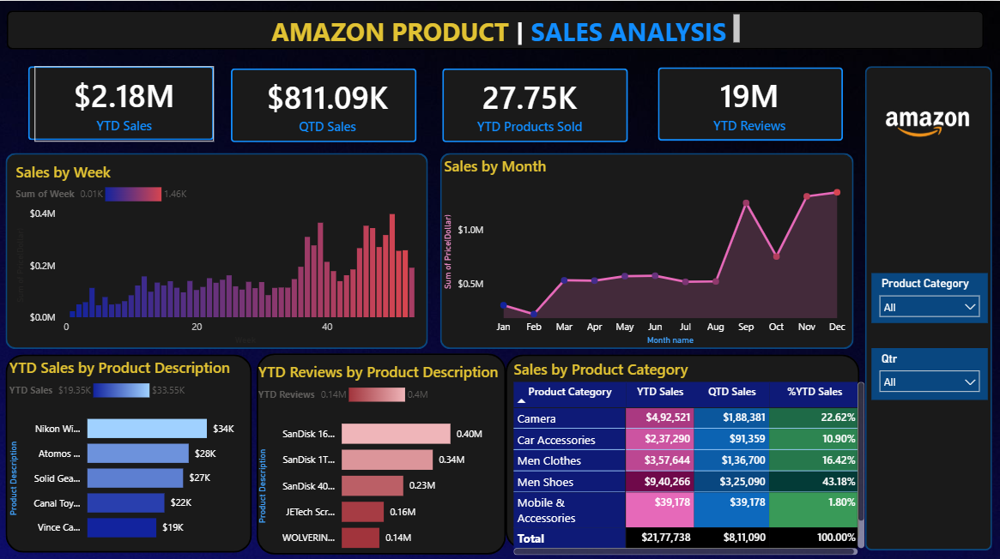

# 📊 Amazon Sales Dashboard

An interactive **Power BI dashboard** developed to analyze Amazon sales data and generate meaningful business insights through KPIs, charts, and interactive visualizations.

## ✨ Features

* Sales and revenue analysis
* Order and product analysis
* Category-wise performance
* Regional sales analysis
* Monthly sales trends
* Interactive filters and visualizations
* Business insights reporting

## 🛠️ Technologies

* **Power BI**
* **DAX**
* **Data Modeling**
* **Microsoft Excel**

## 📂 Project Files

```text
Amazon-Sales-Dashboard/
├── Amazon_Combined_Data.xlsx
├── Sales project.pbix
├── dashboard.png
├── screenshots/
├── Business Insights.docx
└── README.md
```

## 🖼️ Dashboard Preview



## 🚀 How to Use

1. Install **Microsoft Power BI Desktop**.
2. Clone this repository:

```bash
git clone https://github.com/sharmabhumika0101-png/Amazon-Sales-Dashboard.git
```

3. Open `Sales project.pbix` in Power BI Desktop.
4. Refresh the dataset if required.

## 👩‍💻 Author

**Bhumika Sharma**
B.Tech Data Science
Usha Mittal Institute of Technology, Mumbai

---

⭐ If you find this project useful, consider giving it a star!
